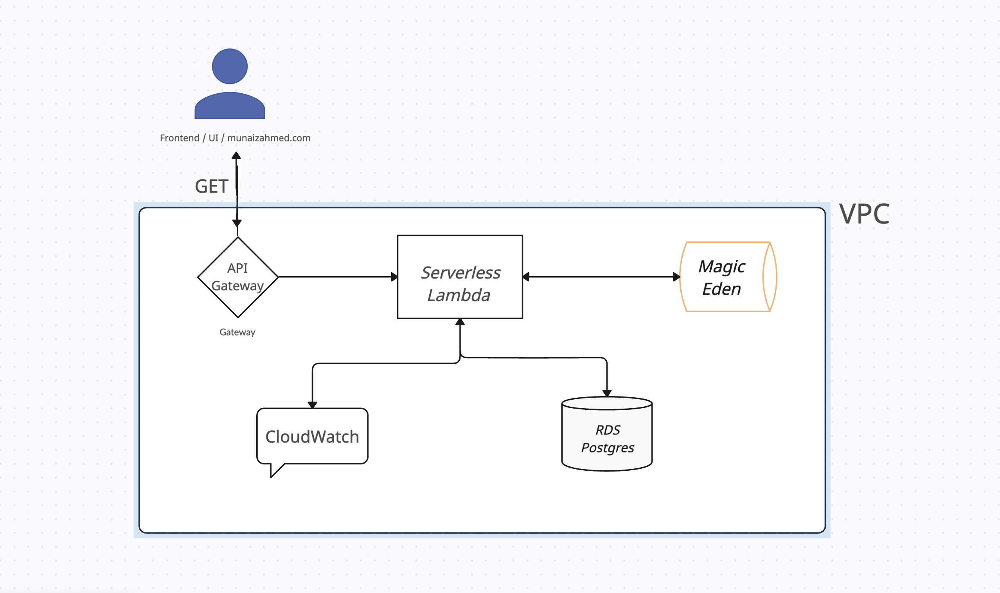

# SatoshiNakamoto_Backend (The Interface)

Although the backend for The Interface is entirely on the cloud, it tries to implent the MVC design pattern in its project folder (albiet a bit contrived for this coding challenge). 

The entry point for the backend is ```index.mjs```, which routes requests to the appropriate functions within ```processors/CollectionsProcessor.js```.

And ```sql/CollectionsSQL.js``` houses the SQL queries that is sent to a database lambda layer that abstracts the common db connection code. More on lambda layers below.


## AWS Cloud Architecture

As mentioned, the backend is on the cloud(AWS) and it utilizes of the follwing AWS technologies:

#### AWS Technologies:
- API Gateway
- Lambda - serverless function that fetches NFT Data from Magic Eden and accesses the database
- RDS PostgreSQL - database that hold the "stale" NFT collection data
- CloudWatch - runtime logs for lambda


*Subnets & Security groups not diagramed or listed above*


### API Gateway
AWS API Gatway exposes the backend to the UI through an GET API request: ```https://lyq1fqdqn9.execute-api.us-east-1.amazonaws.com/dev/collections/{collectionName}```. 

Currently only the following values for ```{collectionName}``` will yield a response to the UI:
- ```/omb```
- ```/quantum_cats```
- ```/ordinal_geese```
- ```/pizza-ninjas``` (*directly update URL in the UI*)
- ```/tiny_vikings``` (*directly update URL in the UI*)
  

### RDS PostgreSQL
The following sql script was used to create the only table in the database:
```SQL
CREATE TABLE Collections (
    id SERIAL ,
    inscription_number INT PRIMARY KEY,
    image_url VARCHAR(255),
    btc_price DECIMAL(18, 8),
    satoshi_price BIGINT,
    collection_symbol VARCHAR(50),
    collection_name VARCHAR(100),
    token_name VARCHAR(100),
    timestamp TIMESTAMP DEFAULT CURRENT_TIMESTAMP
);
```

### AWS Lambda 

The lambda has two main functionalities that is differentiated by two different events. The sample test events are listed below

#### 1. UI Triggered Event (Multiple Invocations) 

```json
{
  "resource": "/collections/{collectionSymbol}",
  "path": "/collections/omb",
  "httpMethod": "GET",
  "headers": null,
  "multiValueHeaders": null,
  "queryStringParameters": null,
  "multiValueQueryStringParameters": null,
  "pathParameters": {
    "collectionSymbol": "quantum_cats"
  },
  "stageVariables": null
}
```

#### 2. Database Seeding Event (Single Invocation) 
In order to properly retrieve data on the UI, you need to seed the database with the NFT collection data by running this this test event from within the aws lambda console.

You can indicate which NFT collection the lambda should retrieve from the Magic Eden API by changing the ```event.queryStringParameters.fetchCollection``` property within the JSON and running the test event and this would seed the database with the forementioned collection.

You only need to do this once for each collection you want to fetch details for. Keep in mind that running this event multiple times for the same NFT collection will result in duplicate NFT collection data. It will **NOT** override the already existing data for the collection but instead will "add it to the list".

```json
{
  "resource": "/collections",
  "path": "/cats",
  "queryStringParameters": {
    "fetchCollection": "tiny_vikings"
  },
  "body": null,
  "isBase64Encoded": false
}
```

### Lambda Layers (Dependencies)

Lambda Layers in AWS allow you to centrally manage common code and dependencies across multiple AWS Lambda functions.

[This](https://github.com/Munaiz123/db_lambda_layer_EasyAudit/tree/master/nodejs) repo, holds the database lambda layer that abstracts the common code accross multiple lambdas to connect with the database. 

Similarly, another lambda layer(*not listed*) abstracts the common node dependencies (node_modules folder) such as axios.  


